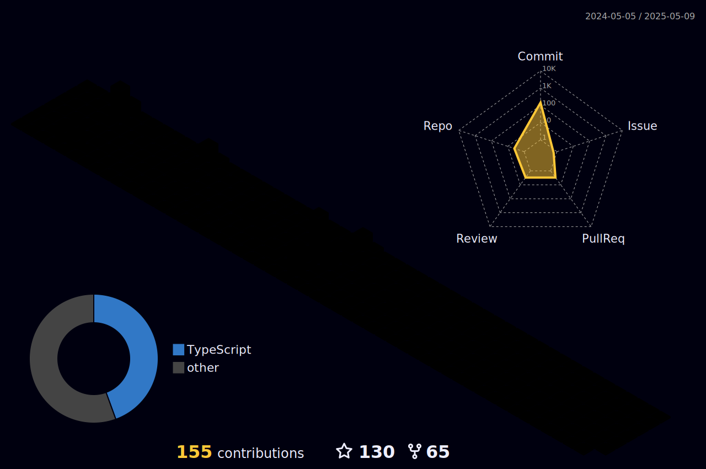

# 🤖 PEDRO AUGUSTO DE CARVALHO VERONEZ  
## Data Scientist | Back-End Developer | Real-World AI in Action

<!-- Contribution Graph -->

<!-- GitHub Summary Cards -->
|  |  |
| ----------- | ----------- |

  

  

---

### 🧠 Real AI, No Nonsense

If you're here looking for fluff, motivational quotes, or buzzwords — you're in the wrong place.  
This profile is about **Artificial Intelligence**, **Machine Learning**, and **practical Data Science** that actually solves problems.

I'm a **Computer Science student** at Faculdade Impacta (São Paulo, Brazil) working on **real-world projects** that require thinking, testing, and building — not pretending.

If it doesn't help me code better, learn deeper, or build smarter, I’m not wasting time on it.

---

### 🚀 What I Actually Do:

- 🤖 **Artificial Intelligence** — building real predictive models with measurable results.
- 🔬 **Machine Learning** — from preprocessing to deployment, no shortcuts.
- 📊 **Data Science** — gathering, cleaning, analyzing, and visualizing real value.
- 🧪 **Python, Pandas, NumPy, Scikit-Learn, Matplotlib, Seaborn**
- 🗄️ **SQL, PostgreSQL, MySQL** — because messy data is useless data.
- 🖥️ **Back-End Development** — Node.js, Express, NestJS, REST APIs, JWT auth, etc.
- ☁️ **AWS** — EC2, S3, Lambda and other cloud services to scale and deploy smartly.
- ⚙️ **Jupyter, Google Colab, Git, Postman, Linux** — my daily tools for exploration and control.

---

### 📡 Let’s Connect

  
  
  

---

If you're into building real stuff with AI, data, and clean code — welcome.  
If not... you can close this tab now.
