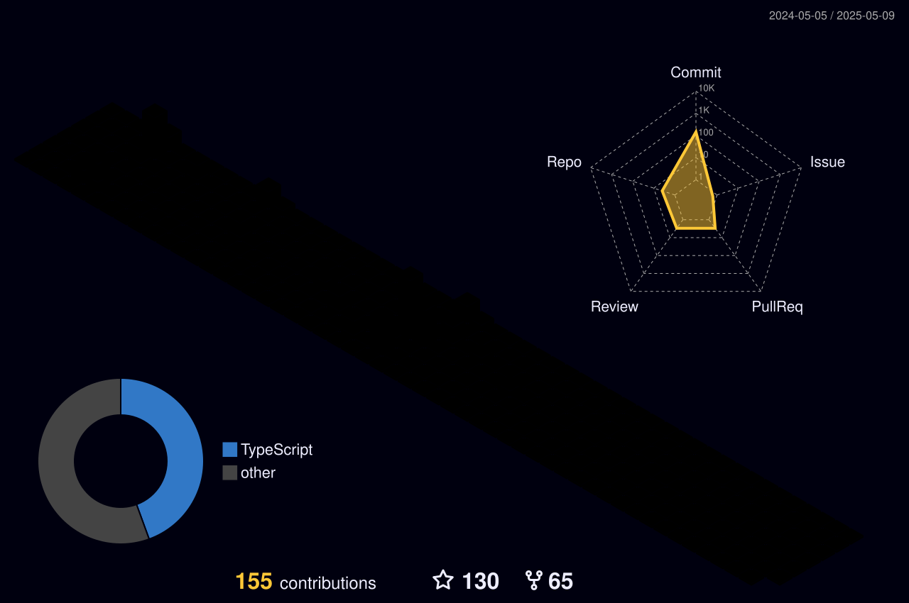

# 👋 Pedro Augusto Veronez

## Full-Stack Developer | Java | C# | Game Development | Artificial Intelligence

|  |  |
| ----------- | ----------- |

  

  

---

# 💻 About Me

I'm currently studying **Systems Analysis and Development** at **Faculdade Impacta** (São Paulo, Brazil).

I'm passionate about building software that solves real problems. Most of my time is dedicated to developing Full-Stack applications, learning software architecture, creating APIs, and exploring new technologies.

Recently, I've also started studying **Game Development**, creating small projects with **Unity** and **Unreal Engine** to improve my programming and game design skills.

I enjoy learning by building real projects and sharing everything I create on GitHub and YouTube.

---

# 🚀 Current Focus

- ☕ Java
- ⚙️ Spring Boot
- 🔷 C#
- 🌐 ASP.NET Core
- ⚛️ React
- 📦 REST APIs
- 🗄️ MySQL & PostgreSQL
- 🐳 Docker
- 🤖 Artificial Intelligence
- 🎮 Unity
- 🎮 Unreal Engine
- 🔧 Software Architecture
- ☁️ Cloud Fundamentals

---

# 🎮 Game Development

Game development is one of my newest learning goals.

I'm currently studying:

- Unity
- Unreal Engine 5
- C#
- Blueprints
- Gameplay Programming
- Level Design fundamentals

The projects are simple on purpose: every game teaches me a new programming concept.

I'll continue publishing my progress here on GitHub and also on YouTube.

---

# 🤖 Artificial Intelligence

Although my current focus is Full-Stack Development, I continue studying Artificial Intelligence and Machine Learning.

I enjoy experimenting with:

- Machine Learning
- LLMs
- AI Chatbots
- Python
- Data Analysis
- Automation

---

# 📂 Featured Projects

- 💻 Full-Stack Web Applications
- 🤖 AI Chatbot
- 🌐 REST APIs
- 🎮 Unity Games
- 🎮 Unreal Engine Projects
- ⚙️ Automation Tools

---

# 📈 Goals for 2026

- Build larger Full-Stack applications
- Publish more Open Source projects
- Improve Java and .NET skills
- Create complete games with Unity and Unreal Engine
- Continue sharing knowledge on YouTube

---

# 📡 Connect with Me

---

> *"Keep building. Every project is one step closer to mastery."*
